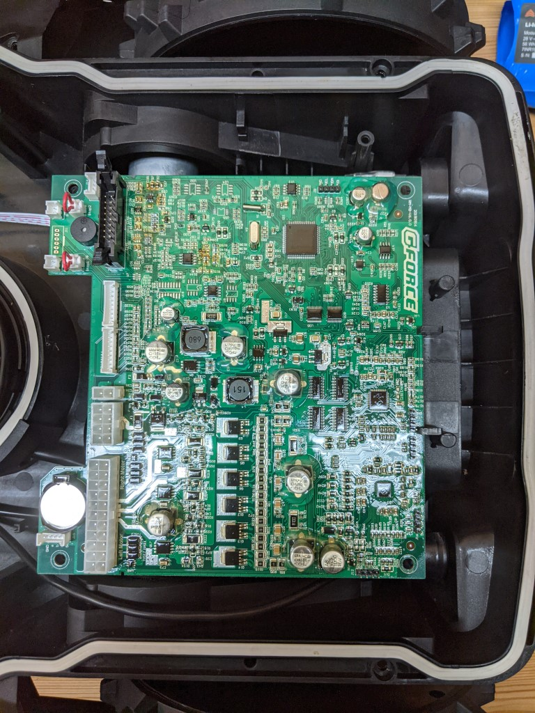

# OpenMower

 

## Join the Discord server for OpenMower discussion: [HERE](https://discord.gg/jE7QNaSxW7)

# About the Project
**:warning: DISCLAIMER:**

**IF YOU ARE NOT 100% SURE WHAT YOU ARE DOING, PLEASE DON'T TRY THIS AT HOME! ASK IN [DISCORD](https://discord.gg/jE7QNaSxW7), IF YOU HAVE ANY QUESTIONS!**

## Project Intro Video

If you want to see a quick overview, you can check out this video:

Let's be honest: The current generation of robotic lawn mowers sucks. Basically all of these bots drive in a random direction until they hit the border of the lawn, rotate for a randomized duration and repeat. **I think we can do better!**

Therefore, we have disassembled the cheapest off-the-shelf robotic mower  we could find (YardForce Classic 500) and were surprised that the hardware itself is actually quite decent:
- Geared sensored brushless motors for the wheels
- A sensored brushless motor for the mower motor itself
- The whole construction seems robust, waterproof and all in all thought through
- All components are connected using standard connectors, therefore upgrading the hardware is easily possible.

The bottom line is: The bot itself is surprisingly high quality and doesn't need to be changed at all. **We just need some better software in there**.

# Project Goals

Here is a quick overview of this project's goals:

:heavy_check_mark: **Autonomous Lawn Mowing:** Obviously, the device should be able to mow the lawn automatically.

:heavy_check_mark: **Good Safety:** The device must be safe, e.g. emergency stop if lifted or crashed.

:heavy_check_mark: **No Perimeter Wire Needed:** We want to be flexible and support multiple mowing areas.

:heavy_check_mark: **Low Cost:** It should be cheaper than a mid range off-the-shelf product

:heavy_check_mark: **Open Source:** I want to share knowledge and enable others to build an OpenMower as well.

:heavy_check_mark: **Nice to Look At:** You should not be ashamed to have an OpenMower mowing your lawn.

:heavy_check_mark: **Avoid Obstacles:** The mower should detect obstacles and avoid them during mowing.

:heavy_check_mark: **Rain Detection:** The device should be able to detect bad weather conditions and pause mowing until they improve.

# Current State

The basic mowing function finally works! As you can see in the video, map teaching and mowing work as expected. It even returns to the docking station automatically as soon as the battery gets low and continues once it's recharged.

At this point I can recommend that brave tech savvy users can build one for themselves! Since it's quite an expensive and complex project, please don't be shy and ask if you have any questions. I'm glad to help 🙂

## Hardware

The first mainboard PCB is almost done. It currently looks like this:

### Hardware To-Do:

- [ ] Low Level Firmware Implementation
  - [x] Voltage / Current Sense
  - [x] Emergency Stop Button tracking
  - [x] IMU Communication
  - [x] Rain Sensor
  - [x] Charging State
  - [ ] Sound Module
  - [ ] UI Board Communication
  - [ ] Low Power Mode
- [X] ROS Hardware Interface
- [ ] Hardware Redesign (bugs / enhancements):
  - [ ] Digial Emergency Stop Signal from Pico to xESC
  - [ ] Sound Module Pinout needs to be adapted to DFPlayer
  - [ ] XT60 Power Connector needs to be connected to main power instead of charging input

# Software

The basic software is basically done; Our prototype works as intended (but is not able to avoid obstacles yet).

The software for the robot can be found in a separate repository: https://github.com/ClemensElflein/open_mower_ros

### Software To-Do:

- [x] Mowing State Machine (Docking / Mowing, ...)
- [x] Path Planning
- [ ] Obstacle Avoidance
- [ ] App / Visualization

# How You Can Help

You can help by starting an OpenMower build of your own. This helps to validate the concept and helps to create useful documentation for new users.

Additionally, you can help by starring 🌟 and watching 👀 this repository, since it will help with visibility. You can also subscribe to my [YouTube channel](https://youtube.com/c/ClemensElflein).

## Compatible Robotic Mowers

While disassembling the bot, I wondered about its mainboard: Instead of "YardForce" it read "GForce". After checking the internet for "GForce" robots, I found that that very similar looking robotic mowers are sold under the Herkules brand. Naturally I tried to dig deeper and actually found evidence that the mainboard is manufactured by some chinese company (SUMTEC Hardware).

It is therefore quite safe to assume that many robot mowers are **basically the same device in a different case**. This would be a huge win for the community, since this would mean that by making one of those robots smarter, we could upgrade **A LOT OF ROBOTS!**

Therefore it might be a good idea to start a list of compatible devices. So if you have a cheap robotic lawn mower, it would be nice of you to check, if it contains the same mainboard as ours and send me some pictures / model numbers.

# More Infos

This page only contains the basic overview of the project. To follow my current development state, check out my [Blog](https://x-tech.online/).

# License

 This work is licensed under a <a rel="license" href="http://creativecommons.org/licenses/by-nc-sa/4.0/">Creative Commons Attribution-NonCommercial-ShareAlike 4.0 International License</a>.

Feel free to use the design in your private/educational projects, but don't try to sell the design or products based on it without getting my consent first. The idea here is to share knowledge, not to enable others to simply sell my work. Thank you for understanding.
